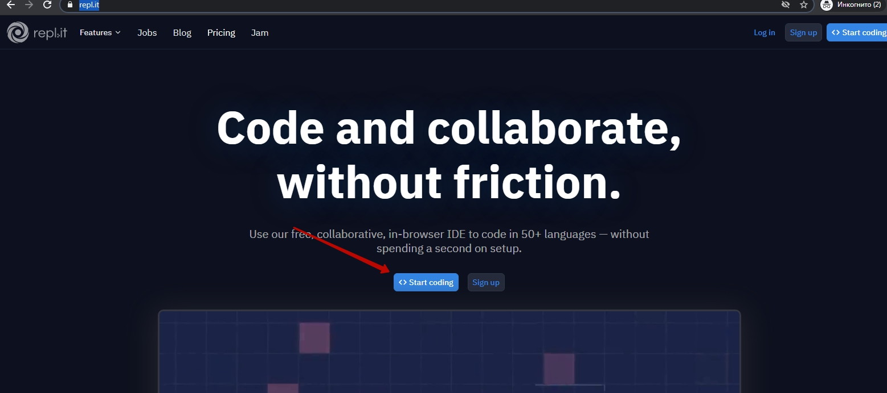
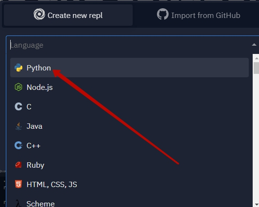
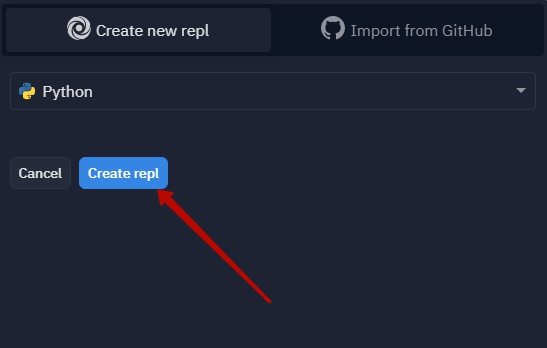
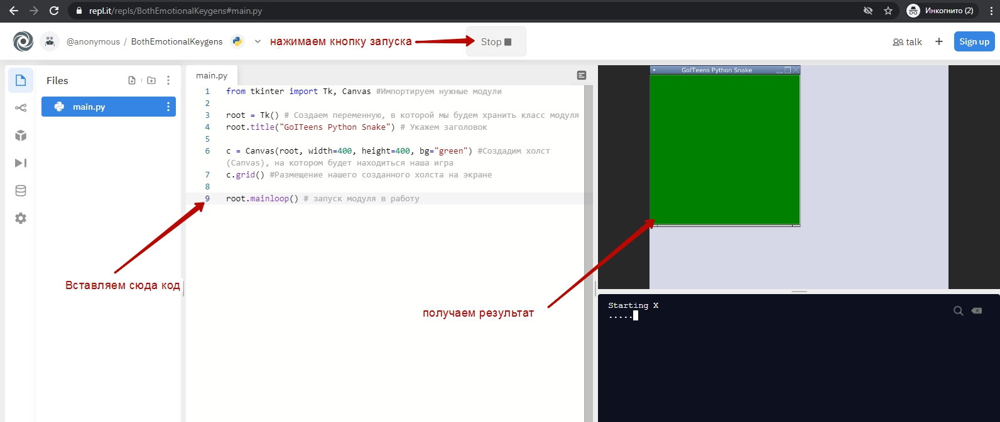
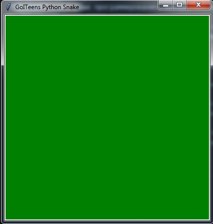
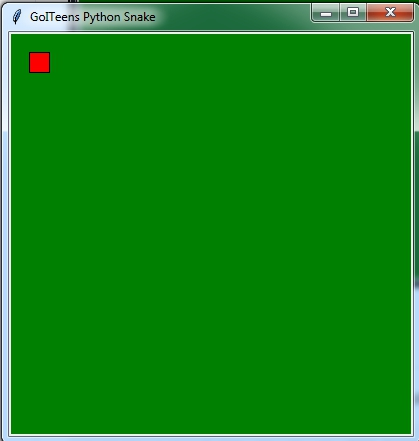
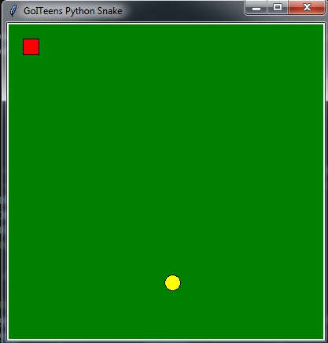
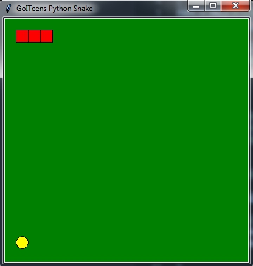
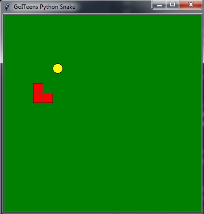

# Создаем игру на Python
**Python** - это язык программирования, который используется в различных сферах: от создания систем искусственного интеллекта до написания программ для веб-серверов.  
На **Python** также можно создавать игры.  
На этом уроке мы познакомимся с основами Python при создании небольшой игры: мы будем создавать игру "Змейка".  
Мы с вами за 1,5 часа создадим базовые элементы и научим змейку двигаться, а далее - добавим несколько элементов и вы сможете полноценно играть в созданную вами игру на своем компьютере.
## Запуск программы
Для запуска программы можно установить интерпретатор Python локально:
Либо же воспользоваться одним из он-лайн компиляторов:
<a href = "https://repl.it/">https://repl.it/</a>
Ниже приведены скриншоты того, как начать работать с <a href = "https://repl.it/">https://repl.it/</a>:  
  
  
  
  

## Холст
Мы будем использовать модуль `tkinter`, который позволяет создавать графический интерфейс.
```python
from tkinter import Tk, Canvas #Импортируем нужные модули

root = Tk() # Создаем переменную, в которой мы будем хранить класс модуля
root.title("GoITeens Python Snake") # Укажем заголовок

c = Canvas(root, width=400, height=400, bg="green") #Создадим холст (Canvas), на котором будет находиться наша игра
c.grid() #Размещение нашего созданного холста на экране

root.mainloop() # запуск модуля в работу
```  
При запуске данной программе получим поле:  


# Элементы змейки
Добавим на холст один элемент змейки: это будет прямоугольник
```python
c.create_rectangle(20, 20, 40, 40, fill="#FF0000")
```


## Яблочко в случайной позиуии
```python
#Позиция яблочка
posx = 20 * random.randint(1, (400-20) / 20) 
posy = 20 * random.randint(1, (400-20) / 20)


#Отрисовка яблочка
BLOCK = c.create_oval(posx, posy,posx+20, posy+20,fill="yellow")
```


У нас получилось нарисовать кусочек змейки и яблоко. И мы их нарисовали отдельно. В программировании - для сложных конструкций используются классы. Такие блоки, которые можно 1 раз создать и далее вызывать во всех нужных ситуациях.
Определим общие параметры нашей игры:
```python
x = 20  #Начинается наша змейка с координаты x равной 20
y = 20 #Начинается наша змейка с координаты y равной 20
SEG_SIZE = 20 #Размер элемента змейки равен 20
WIDTH = 400 #Ширина поля
HEIGHT = 400 # Высота поля
```

Создадим класс сегмента змейки, который при вызове будет создавать прямоугольник.
```python
class Segment(object):
    def __init__(self, x, y):
        self.instance = c.create_rectangle(x, y, x+SEG_SIZE, y+SEG_SIZE, fill="#FF0000")
```
И Создадим класс змейки, которая состоит из сегментов.
```python
#Класс змейки
class Snake(object):
    def __init__(self, segments):
        self.segments = segments #Сколько сегментов получили - такая и змейка по размеру
```
А также отдельно создадим функцию, которая вызовет новую змейку
```python
def create_snake():
    # Создаем сегменты и змейку
    segments = [Segment(SEG_SIZE, SEG_SIZE), Segment(SEG_SIZE*2, SEG_SIZE), Segment(SEG_SIZE*3, SEG_SIZE)] #Список из трех сегментов
    return Snake(segments)
```
И непосредственно вызовем функцию создания змейки:
```python
    create_snake()
```
Получим следующий код:
```python
from tkinter import Tk, Canvas #Импортируем нужные модули
import random


root = Tk() # Создаем переменную, в которой мы будем хранить класс модуля
root.title("GoITeens Python Snake") # Укажем заголовок

c = Canvas(root, width=400, height=400, bg="green") #Создадим холст (Canvas), на котором будет находиться наша игра
c.grid() #Размещение нашего созданного холста на экране


x = 20  #Начинается наша змейка с координаты x равной 20
y = 20 #Начинается наша змейка с координаты y равной 20
SEG_SIZE = 20 #Размер элемента змейки равен 20
WIDTH = 400
HEIGHT = 400
#Нарисуем змею из 1 элемента

c.create_rectangle(x, y, x+20, y + 20, fill="#FF0000")

#Позиция яблочка
posx = 20 * random.randint(1, (400-20) / 20)
posy = 20 * random.randint(1, (400-20) / 20)


#Отрисовка яблочка
BLOCK = c.create_oval(posx, posy,posx+20, posy+20,fill="yellow")


class Segment(object):
    # Один сегмент змейки
    def __init__(self, x, y):
        self.instance = c.create_rectangle(x, y, x+SEG_SIZE, y+SEG_SIZE, fill="#FF0000")


#Класс змейки
class Snake(object):
    def __init__(self, segments):
        self.segments = segments #Сколько сегментов получили - такая и змейка по размеру


def create_snake():
    # Создаем сегменты и змейку
    segments = [Segment(SEG_SIZE, SEG_SIZE), Segment(SEG_SIZE*2, SEG_SIZE), Segment(SEG_SIZE*3, SEG_SIZE)] #Список из трех сегментов
    return Snake(segments)

create_snake()


root.mainloop() # запуск модуля в работу
```


Добавим змейке возможность двигаться:
Доработаем метод, который запускается при создании класса:
```python
def __init__(self, segments):
    self.segments = segments #Сколько сегментов получили - такая и змейка по размеру
    self.mapping = {"Down": (0, 1), "Right": (1, 0), "Up": (0, -1), "Left": (-1, 0), "a": (-1, 0)}         # Возможные направления движения
    self.vector = self.mapping["Down"]  # начальные направления движения
```
Добавляем метод, который "научит" змейку "Ходить".
```python
    def move(self): # Двигаем змейку по определенному вектору
        for index in range(len(self.segments)-1):
            segment = self.segments[index].instance
            x1, y1, x2, y2 = c.coords(self.segments[index+1].instance)
            c.coords(segment, x1, y1, x2, y2)

        x1, y1, x2, y2 = c.coords(self.segments[-2].instance)
        c.coords(self.segments[-1].instance,x1+self.vector[0]*SEG_SIZE, y1+self.vector[1]*SEG_SIZE,x2+self.vector[0]*SEG_SIZE, y2+self.vector[1]*SEG_SIZE)
```
Учим змейку изменять направление и останавливаться, при нажатии пробела:
```python
    def change_direction(self, event): # Изменяем направление змейки 
        if event.keysym in self.mapping:
            self.vector = self.mapping[event.keysym]
        print(event.keysym)
        global game
        if event.keysym == "space":
            game = not(game)
            print(game)
```
А также функцию, которая запускает движение змейки:
```python
def move():
    c.bind("<KeyPress>", s.change_direction)
    if game:
        root.after(200, move)
    s.move()
```
И вызываем эту функцию:
```python
move()
```
А также добавим слушатель нажатия клавиш на клавиатуре:
```python
c.focus_set()
```
А также удалим элементы кода, которые мы использовали вначале для демонстрации возможностей:
```python
create_snake()
```
```python
c.create_rectangle(x, y, x+20, y + 20, fill="#FF0000")
```


Полный код игры:
```python
from tkinter import Tk, Canvas #Импортируем нужные модули
import random


root = Tk() # Создаем переменную, в которой мы будем хранить класс модуля
root.title("GoITeens Python Snake") # Укажем заголовок

c = Canvas(root, width=400, height=400, bg="green") #Создадим холст (Canvas), на котором будет находиться наша игра
c.grid() #Размещение нашего созданного холста на экране


x = 20  #Начинается наша змейка с координаты x равной 20
y = 20 #Начинается наша змейка с координаты y равной 20
SEG_SIZE = 20 #Размер элемента змейки равен 20
WIDTH = 400
HEIGHT = 400
#Нарисуем змею из 1 элемента

c.focus_set()
#Позиция яблочка
posx = 20 * random.randint(1, (400-20) / 20)
posy = 20 * random.randint(1, (400-20) / 20)

#Отрисовка яблочка
BLOCK = c.create_oval(posx, posy,posx+20, posy+20,fill="yellow")

class Segment(object):
    # Один сегмент змейки
    def __init__(self, x, y):
        self.instance = c.create_rectangle(x, y, x+SEG_SIZE, y+SEG_SIZE, fill="#FF0000")
        self.mapping = {"Down": (0, 1), "Right": (1, 0), "Up": (0, -1), "Left": (-1, 0), "a": (-1, 0)}         # Возможные направления движения
        self.vector = self.mapping["Down"]  # начальные направления движения

#Класс змейки
class Snake(object):
    def __init__(self, segments):
        self.segments = segments #Сколько сегментов получили - такая и змейка по размеру
        self.mapping = {"Down": (0, 1), "Right": (1, 0), "Up": (0, -1), "Left": (-1, 0), "a": (-1, 0)}         # Возможные направления движения
        self.vector = self.mapping["Down"]  # начальные направления движения

    def move(self): # Двигаем змейку по определенному вектору
        for index in range(len(self.segments)-1):
            segment = self.segments[index].instance
            x1, y1, x2, y2 = c.coords(self.segments[index+1].instance)
            c.coords(segment, x1, y1, x2, y2)
        x1, y1, x2, y2 = c.coords(self.segments[-2].instance)
        c.coords(self.segments[-1].instance,x1+self.vector[0]*SEG_SIZE, y1+self.vector[1]*SEG_SIZE,x2+self.vector[0]*SEG_SIZE, y2+self.vector[1]*SEG_SIZE)


    def change_direction(self, event): # Изменяем направление змейки 
        if event.keysym in self.mapping:
            self.vector = self.mapping[event.keysym]
        global game
        if event.keysym == "space":
            game = not(game)

def create_snake():
    # Создаем сегменты и змейку
    segments = [Segment(SEG_SIZE, SEG_SIZE), Segment(SEG_SIZE*2, SEG_SIZE), Segment(SEG_SIZE*3, SEG_SIZE)] #Список из трех сегментов
    return Snake(segments)

global game 
game = True

def move():
    c.bind("<KeyPress>", s.change_direction)
    if game:
        root.after(200, move)
    s.move()

s = create_snake()
move()

root.mainloop() # запуск модуля в работу
```



Для того, чтобы наша змейка имела полный функционал нужно добавить возможность съедать яблочки, расти и условия, при которых змейка погибает (ударяется в край или саму себя) и механизм того, как начать играть заново.
```python
from tkinter import Tk, Canvas
import random

# Globals
WIDTH = 400
HEIGHT = 400
SEG_SIZE = 10
IN_GAME = True

#Создаем блок
# Helper functions
def create_block():
    """ Creates an apple to be eaten """
    global BLOCK
    posx = SEG_SIZE * random.randint(1, (WIDTH-SEG_SIZE) / SEG_SIZE)
    posy = SEG_SIZE * random.randint(1, (HEIGHT-SEG_SIZE) / SEG_SIZE)
    BLOCK = c.create_oval(posx, posy,
                          posx+SEG_SIZE, posy+SEG_SIZE,
                          fill="green")


def main():
    """ Handles game process """
    global IN_GAME
    if IN_GAME:
        s.move()
        head_coords = c.coords(s.segments[-1].instance)
        x1, y1, x2, y2 = head_coords
        # Check for collision with gamefield edges
        if x2 > WIDTH or x1 < 0 or y1 < 0 or y2 > HEIGHT:
            IN_GAME = False
        # Eating apples
        elif head_coords == c.coords(BLOCK):
            s.add_segment()
            c.delete(BLOCK)
            create_block()
        # Self-eating
        else:
            for index in range(len(s.segments)-1):
                if head_coords == c.coords(s.segments[index].instance):
                    IN_GAME = False
        root.after(100, main)
    # Not IN_GAME -> stop game and print message
    else:
        set_state(restart_text, 'normal')
        set_state(game_over_text, 'normal')

class Segment(object):
    # Один сегмент змейки
    def __init__(self, x, y):
        self.instance = c.create_rectangle(x, y, x+SEG_SIZE, y+SEG_SIZE, fill="#FF0000")


#Класс змеи
class Snake(object):
    """ Simple Snake class """
    def __init__(self, segments):
        self.segments = segments
        # Возможные направления движения
        self.mapping = {"Down": (0, 1), "Right": (1, 0),
                        "Up": (0, -1), "Left": (-1, 0), "a": (-1, 0)}
        # начальные направления движения
        self.vector = self.mapping["Down"]

    def move(self):
        """ Moves the snake with the specified vector"""
        for index in range(len(self.segments)-1):
            segment = self.segments[index].instance
            x1, y1, x2, y2 = c.coords(self.segments[index+1].instance)
            c.coords(segment, x1, y1, x2, y2)

        x1, y1, x2, y2 = c.coords(self.segments[-2].instance)
        c.coords(self.segments[-1].instance,
                 x1+self.vector[0]*SEG_SIZE, y1+self.vector[1]*SEG_SIZE,
                 x2+self.vector[0]*SEG_SIZE, y2+self.vector[1]*SEG_SIZE)

    def add_segment(self):
        """ Adds segment to the snake """
        last_seg = c.coords(self.segments[0].instance)
        x = last_seg[2] - SEG_SIZE
        y = last_seg[3] - SEG_SIZE
        self.segments.insert(0, Segment(x, y))

    def change_direction(self, event):
        """ Changes direction of snake """
        if event.keysym in self.mapping:
            self.vector = self.mapping[event.keysym]

    def reset_snake(self):
        for segment in self.segments:
            c.delete(segment.instance)


def set_state(item, state):
    c.itemconfigure(item, state=state)


def clicked(event):
    global IN_GAME
    s.reset_snake()
    IN_GAME = True
    c.delete(BLOCK)
    c.itemconfigure(restart_text, state='hidden')
    c.itemconfigure(game_over_text, state='hidden')
    start_game()


def start_game():
    global s
    create_block()
    s = create_snake()
    # Reaction on keypress
    c.bind("<KeyPress>", s.change_direction)
    main()


def create_snake():
    # creating segments and snake
    segments = [Segment(SEG_SIZE, SEG_SIZE),
                Segment(SEG_SIZE*2, SEG_SIZE),
                Segment(SEG_SIZE*3, SEG_SIZE)]
    return Snake(segments)


# Setting up window
root = Tk()
root.title("PythonicWay Snake")


c = Canvas(root, width=WIDTH, height=HEIGHT, bg="green")
c.grid()
# catch keypressing
c.focus_set()
game_over_text = c.create_text(WIDTH/2, HEIGHT/2, text="GAME OVER!!!!",
                               font='Arial 20', fill='red',
                               state='hidden')
restart_text = c.create_text(WIDTH/2, HEIGHT-HEIGHT/3,
                             font='Arial 20',
                             fill='white',
                             text="Нажмите для перезапуска",
                             state='hidden')
c.tag_bind(restart_text, "<Button-1>", clicked)
start_game()
root.mainloop()

```