# Пробное занятие Python
**Что такое Программирование?**  
Это сфера написания компьютерных программ.  
**Что такое компьютерные программы?**  
Это инструкции для компьютера, которые он умеет выполнять!
**Почему программирование хорошо оплачивается?**
Потому что одна программа заменяет большое количество людей длительное время. Первые программы писались для расчетов. В итоге 1 программа заменяла работу целого отдела математиков. В итоге - это позволяет хорошо оплачивать труд создателей программ.  
Принцип сохранился: программы заменяют людей, только расширились сферы применения:  
* Расчеты
* Учет
* Продажи
* Презентации
* Игры

А в последние несколько лет стало очень актуальным направления сбора и анализа данных и принятия, на основании этих данных решений. Т.е. компьютеры "научились" практически всему что умеют люди, программы искусственного интеллекта даже копируют структуру нашего мозга создавая искусственные нейронные сети, использующие тот же принцип работы, что и нейронные сети в мозгу человека.  
Чтобы понимать компьютеры очень помогают аналогии с людьми. Это хорошо работает, т.к. компьютеры созданы по примеру человека. У нас с ними похожая структура.  
А языки программирования и их использование похожи на использование человеческих языков. Английский - удобен для проведения переговоров по всему миру. Можно сказать, что это язык общего назначения. Но для того, чтобы жить и общаться, скажем - в Словакии. Лучше подойдет словацкий язык: коммуникация на нем с жителями Словакии будет происходить намного быстрее.  В то же время английский в Ирландии, Британии, США для повседневного общения подходит лучше других.
Так и языки программирования - каждый удобен для использования в определенной сфере. Python - это, как английский, может быть использован в большом количестве сфер, но есть те сферы, в которых он справляется лучше других: анализ данных, создание систем искусственного интеллекта и Web-программирование.  
## Как работают программы?
Программу можно представить в виде здания, которое выполняет определенную функцию: это может быть жилой дом, больница или офисный центр. Здания - состоят из кирпичиков, а программы состоят из команд (инструкций) для компьютера. А также из управляющих конструкций - которые говорят когда какие инструкции выполнять и переменных, которые хранят значения, которые программа обрабатывает. Т.е. инструкции - это как кирпичики, управляющие конструкции - это как указатели куда можно ходить (какие помещения из кирпичиков использовать), а переменные - это люди, которые ходят по помещению.
## Давайте попробуем?
У программистов есть традиция начинать изучение языка программирования с вывода строки `"Hello, world!"` - этой традиции уже 42 (!) года. Не будем изменять этой традиции.
Для того, чтобы вывести строку `"Hello, world!"` на языке программирования `Python` необходимо написать команду `print`:
```python
print("Hello, world!")
```
## Среда запуска. Первая программа.
**Понимает ли компьютер язык программирования на прямую?**  
Нет! Компьютер понимает исключительно машинный код. Машинный код - это набор 0 и 1.  
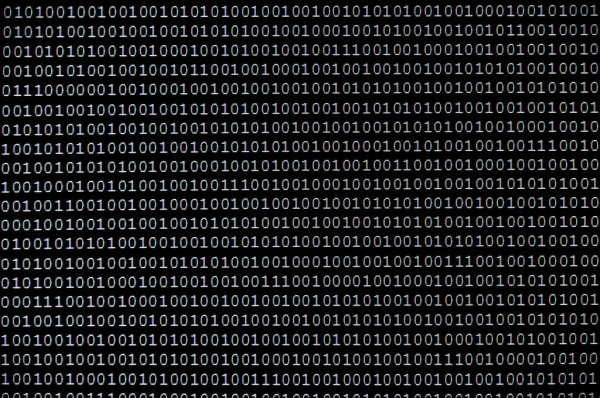  
Чтобы перевести с языка программирования на "машинный" используется специальная программа-переводчик, которая называется `транслятор`. Для того, чтобы выполнить программу, написанную на `Python` необходим такой транслятор.  
Его можно установить на свой компьютер, но можно использовать и он-лайн версию таких программ. Для знакомства - нам будет достаточно использовать он-лайн транслятор [https://repl.it/](https://repl.it/).
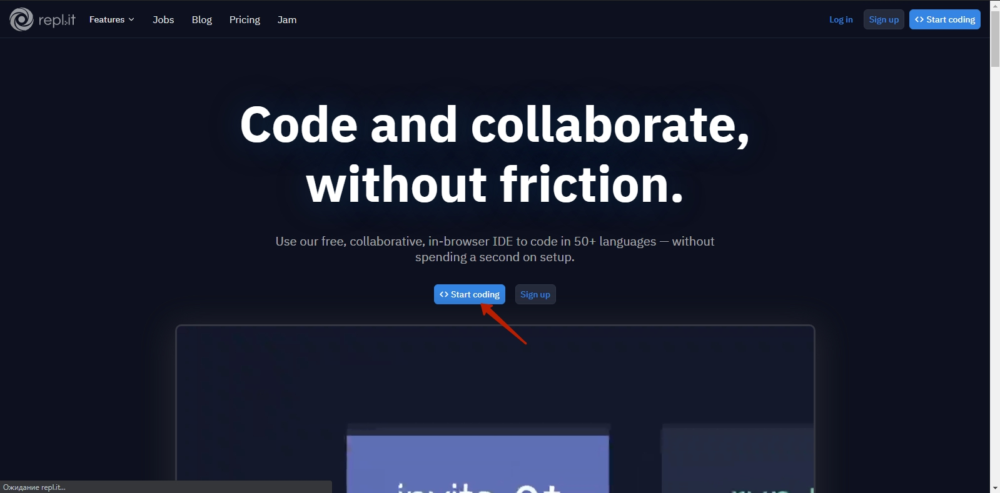  
Выбрать на главной странице создание кода  
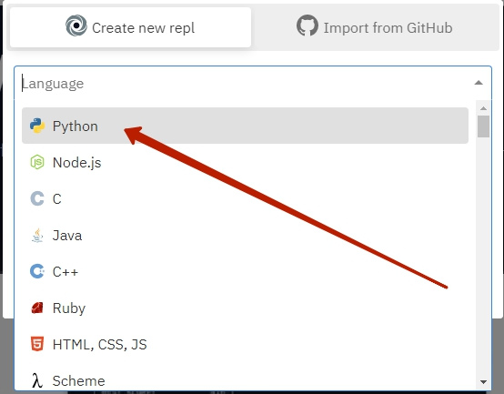  
Выбрать язык программирования Python  
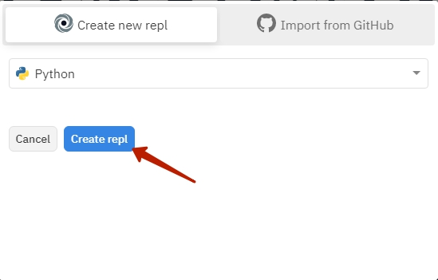  
Подтвердить выбор языка Python  
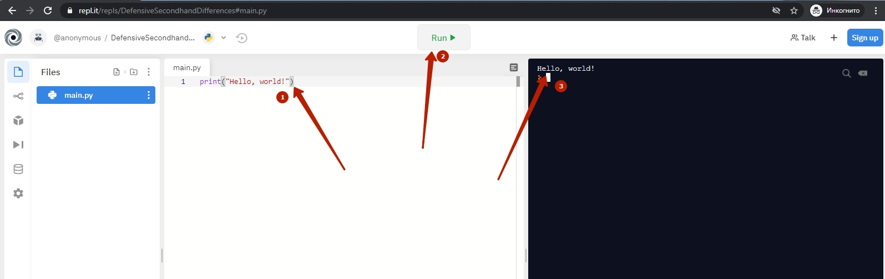  

1. Написать программу. 2. Запустить программу. 3. Просмотреть результат.  
## Переменные в Python. Строки
"Hello, world" - это набор символов, т.е. строка. И мы можем эту строку сохранить в переменную. И выводить не сам набор символов, а уже значение переменной. Выглядит это как будто мы создали ящик с именем `s`, положили в этот ящик положили в определенной последовательности кубики Hello, world. А дальше - прочитали буквы на кубиках, которые лежали в ящике `s`  
```python
s = "Hello, world!"
print(s)
```
При этом для переменные со строками можно соединять:
```python
s1 = "Hello, "
s2 = "world!"
s = s1 + s2
print(s)
```
## Переменные в Python. Числа
Кроме строковых переменных в Python существуют и числовые:
```python
a = 2
b = 3
c = a + b
print(c)
```
Операции с числовыми переменными - максимально близки к операциями на уроках математики: определены всем известные 4 арифметических оператора `+`,`-`,`*`,`/`.
```python
a = 2
b = 3
plus = a + b
minus = a - b
mult = a * b
devide = a / b
print("a + b = " + plus )
print("a - b = " + minus )
print("a * b = " + mult )
print("a / b = " + devide )
```
## Ввод данных
Важной частью  любой программы является ввод данных.
```python
a = input("Введите число а")
b = input("Введите число b")
c = a + b
print(c) 
```
Если мы введем значение a = 2, значение b = 3 и попробуем сложить эти два числа, то получим 23. Так происходит из-за того, что наш транслятор введенные значения считает строками и применяет к ним операцию `+` как для строк. Т.е. объединяет две строки.  

Для того, чтобы получить сумму чисел 2 и 3 нам необходимо их преобразовать в числа после чтения. для этого применим команду `int()`, которая преобразует в число, если это возможно, строки которые находятся у неё в скобках.
```python
a = int(input("Введите число а"))
b = int(input("Введите число b"))
c = a + b
print(c) 
```
Теперь мы можем получить числа от пользователя, произвести с ними операции и вывести результат. Такие программы, в которых все инструкции выполняются одна за одной - называются линейными.
## Оператор выбора
В нашей жизни мы часто принимаем решение (делаем выбор). Если на улице тепло - надеваем футболку, если холодно - куртку. Если дверь закрыта - достаем ключ и поворачиваем в замочной скважине. Когда мы хотим закипетить чайник мы смотрим в него, если он пуст - наливаем туда воды.  
В программировании для описания принятия решения, используется оператор выбора.
```python
a = int(input("Введите число а")) #Читаем число
if a > 0:   #Если число a больше 0
    print("число a - положительное") # то выводим строку "число a - положительное
```
## Список
В нашей жизни мы часто используем списки. Что это такое? Например, мама говорит ребенку - купи масло, сахар и овсянку. Это и есть список: последовательность элементов. В `Python` список записывается следующим образом `lst = ["масло","сахар","овсянка"]` при этом обращение к элементам списка может быть по одному: команда `print(l[0])` выведет в консоль `"масло"`:
```python
lst = ["масло","сахар","овсянка"]
print(lst[0]) #выведет "масло"
print(lst[1]) #выведет "сахар"
print(lst[2]) #выведет "овсянка"
```
Но если вы пришли в магазин, у вас есть список и продавец у вас спрашивает: "Что вам?" вы перечислите все элементы списка. Для этого действия в `Python` используется цикл for.
```python
lst = ["масло","сахар","овсянка"]
for l in lst:
    print(l)
```
На каждом шагу цикла значение переменной `l` будет получать следующий элемент списка, который "просматривается".
## Словарь
В обычной жизни люди часто сталкиваются с записями в журнале учета. Это может быть журнал учета посещаемости, абитуриентов, сотрудников компании. Особенность таких журналов в том, что мы видим набор записей, каждая из них отвечает за определенный элемент. При этом разные элементы такой записи могут иметь разный тип. В `Python` такую запись можно описать с помощью специальной структуры словарь. Например запись о абитуриенте, у которого есть поля: "Фамилия, имя", "год рождения", "оценка 1", "оценка 2" можно описать так:
`abitur = {'fio':"Студентов Студент",'year':1995,'mark1':10,'mark2':12}`, вывести элементы на можно следующим образом: `print(abitur.fio)`
```python
abitur = {'fio':"Студентов Студент",'year':1995,'mark1':10,'mark2':12}
ptint(abitur.fio)
```
Но обычно такие записи идут в журнале, т.е. составляется список записей (словарей). Для этого в начале программы создается пустой список `abiturs = []`, а дальше каждый созданный элемент (словарь) добавляется к этому списку с помощью метода `append`: `abiturs.append(abitur)`.
А просматривать такой список словарей можно с использованием уже знакомой конструкции цикла
```python
abiturs = []
abitur = {'fio':"Студентов Студент",'year':1995,'mark1':10,'mark2':12}
abiturs.append(abitur)

abitur = {'fio':"Петр Петрук",'year':1995,'mark1':11,'mark2':11}
abiturs.append(abitur)

abitur = {'fio':"Слава Славенко",'year':1995,'mark1':12,'mark2':12}
abiturs.append(abitur)
for ab in abiturs
    print(f"{ab.fio}, {ab.year}, {ab.mark1}, {ab.mark2}")
```
## Викторина в консоли
```python
answer = input("Какой язык самый популярный:\n 1. JavaScript \n 2. Python \n 3. Java \n 4. C#\n")


if answer == "1":
    print("Правильный ответ")
else:
    print("Не правильный ответ")


answer = input("Какая средняя зарплата Python-Разработчика:\n 1. 2000 \n 2. 1500 \n 3. 2500 \n 4. 3000\n")
if answer == "3":
    print("Правильный ответ")
else:
    print("Не правильный ответ")

answer = input("Какая доля Python-разработки в Украине на 2020 год:\n 1. 25% \n 2. 12,4% \n 3. 13,2% \n 4. 17,1%\n")
if answer == "3":
    print("Правильный ответ")
else:
    print("Не правильный ответ")
```
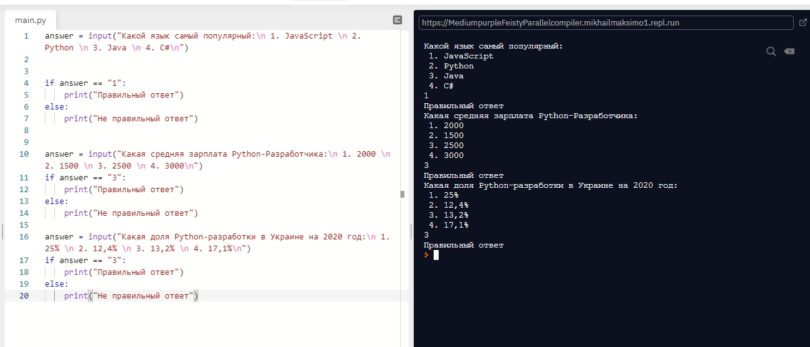  

## Викторина в консоли с циклами
```python
dicts = []

q = {'question':"Какой язык самый популярный:",'answer1':"JavaScript",'answer2':"Python",'answer3':"Java",'answer4':"C#",'right':'1'}
dicts.append(q)
q = {'question':"Какая средняя зарплата Python-Разработчика:",'answer1':"1500",'answer2':"2000",'answer3':"2500",'answer4':"3000",'right':'3'}
dicts.append(q)
q = {'question':"Какая доля Python-разработки в Украине на 2020 год:",'answer1':"25%",'answer2':"12,4%",'answer3':"13,2%",'answer4':"17,1%",'right':'3'}
dicts.append(q)


result = 0
for dct in dicts:
    answ = f"{dct['question']}\n 1. {dct['answer1']} | 2. {dct['answer2']} | 3. {dct['answer3']} | 4. {dct['answer4']} \n"
    answer =input(answ)
    if answer == dct['right']:
        result += 1

print(f"Ваш результат: {result} из 3")
```
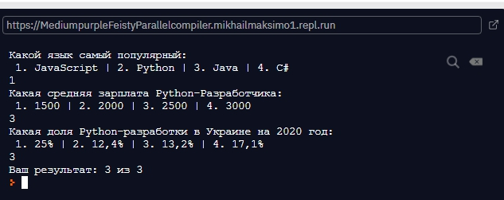  

## Графические элементы для викторины
```python
from tkinter import Tk, Canvas
import random

# Globals
WIDTH = 400
HEIGHT = 400

root = Tk()
root.title("PythonicWay Quiz")

c = Canvas(root, width=800, height=400, bg="white")
c.grid()
restart_text = c.create_text(400, 50,
                             font='Arial 20',
                             fill='black',
                             text="Текст вопроса ",
                             state='hidden'
                            )

right_answer = c.create_text(400, 150,
                             font='Arial 20',
                             fill='green',
                             text="Правильный ответ ",
                             state='hidden'
                            )

wrong_answer = c.create_text(400, 150,
                             font='Arial 20',
                             fill='red',
                             text="Не правильный ответ ",
                             state='hidden'
                            )

rect1 = c.create_rectangle(0,200,400,300,fill='orange')
rect2 = c.create_rectangle(400,200,800,300,fill='pink')
rect3 = c.create_rectangle(0,300,400,400,fill='blue')
rect4 = c.create_rectangle(400,300,800,400,fill='yellow')

answer_text1 = c.create_text(200, 250,font='Arial 30', fill='black', text="Ответ 1", state='normal', activefill = 'bisque', justify = "center")
answer_text2 = c.create_text(600, 250,font='Arial 30', fill='black', text="Ответ 2", state='normal', activefill = 'bisque', justify = "left")
answer_text3 = c.create_text(200, 350,font='Arial 30', fill='black', text="Ответ 3", state='normal', activefill = 'bisque')
answer_text4 = c.create_text(600, 350,font='Arial 30', fill='black', text="Ответ 4", state='normal', activefill = 'bisque')

next_question = c.create_text(680, 180,
                             font='Arial 15',
                             fill='green',
                             text="Следующий вопрос ->",
                             state='hidden'
                            )

c.itemconfigure(restart_text, state='normal')

right = 3
def clicked(event):
    print(event.x)
    print(event.y)
 
    if event.x>0 and event.x<400 and event.y>200 and event.y<300:
       userAnswer = 1
    
    if event.x>400 and event.x<800 and event.y>200 and event.y<300:
        userAnswer = 2

    if event.x>0 and event.x<400 and event.y>300 and event.y<400:
        userAnswer = 3

    if event.x>400 and event.x<800 and event.y>300 and event.y<400:
        userAnswer = 4

    if right == userAnswer:
        c.itemconfigure(wrong_answer, state='hidden')
        c.itemconfigure(right_answer, state='normal')
    else:
        c.itemconfigure(right_answer, state='hidden')
        c.itemconfigure(wrong_answer, state='normal')

    c.itemconfigure(next_question, state='normal')

def nextQuestion(event):
    print("NextQuestion")


c.tag_bind(answer_text1, "<Button-1>", clicked)
c.tag_bind(answer_text2, "<Button-1>", clicked)
c.tag_bind(answer_text3, "<Button-1>", clicked)
c.tag_bind(answer_text4, "<Button-1>", clicked)

c.tag_bind(next_question, "<Button-1>", nextQuestion)

root.mainloop()

```
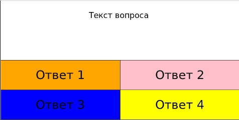  
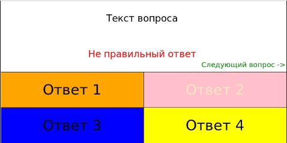  
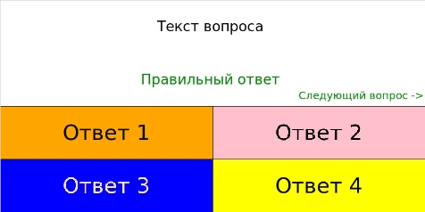  

## Итоговая виторина
```python
from tkinter import Tk, Canvas
import random


dicts = []

q = {'question':"Какой язык самый популярный:",'answer1':"JavaScript",'answer2':"Python",'answer3':"Java",'answer4':"C#",'right':1}
dicts.append(q)
q = {'question':"Какая доля Python:",'answer1':"12%",'answer2':"13,2%",'answer3':"15%",'answer4':"50%",'right':2}
dicts.append(q)
q = {'question':"Сколько в среденем зарабатывает Python-разработчик:",'answer1':"$1500",'answer2':"$2000",'answer3':"$2500",'answer4':"$2500",'right':3}
dicts.append(q)
nQuestion = 0
allQuestion = 3
result = 0


# Globals
WIDTH = 400
HEIGHT = 400

root = Tk()
root.title("PythonicWay Quiz")

c = Canvas(root, width=800, height=400, bg="white")
c.grid()
restart_text = c.create_text(400, 50,
                             font='Arial 20',
                             fill='black',
                             text=dicts[nQuestion].get('question'),
                             state='hidden'
                            )

right_answer = c.create_text(400, 150,
                             font='Arial 20',
                             fill='green',
                             text="Правильный ответ ",
                             state='hidden'
                            )

wrong_answer = c.create_text(400, 150,
                             font='Arial 20',
                             fill='red',
                             text="Не правильный ответ ",
                             state='hidden'
                            )

rect1 = c.create_rectangle(0,200,400,300,fill='orange')
rect2 = c.create_rectangle(400,200,800,300,fill='pink')
rect3 = c.create_rectangle(0,300,400,400,fill='blue')
rect4 = c.create_rectangle(400,300,800,400,fill='yellow')

answer_text1 = c.create_text(200, 250,font='Arial 30', fill='black', text=dicts[nQuestion].get('answer1'), state='normal', activefill = 'bisque', justify = "center")
answer_text2 = c.create_text(600, 250,font='Arial 30', fill='black', text=dicts[nQuestion].get('answer2'), state='normal', activefill = 'bisque', justify = "left")
answer_text3 = c.create_text(200, 350,font='Arial 30', fill='black', text=dicts[nQuestion].get('answer3'), state='normal', activefill = 'bisque')
answer_text4 = c.create_text(600, 350,font='Arial 30', fill='black', text=dicts[nQuestion].get('answer4'), state='normal', activefill = 'bisque')

next_question = c.create_text(680, 180,
                             font='Arial 15',
                             fill='green',
                             text="Следующий вопрос ->",
                             state='hidden'
                            )

c.itemconfigure(restart_text, state='normal')

right = 3
def clicked(event):
    print(event.x)
    print(event.y)
    global result
    if event.x>0 and event.x<400 and event.y>200 and event.y<300:
       userAnswer = 1
    
    if event.x>400 and event.x<800 and event.y>200 and event.y<300:
        userAnswer = 2

    if event.x>0 and event.x<400 and event.y>300 and event.y<400:
        userAnswer = 3

    if event.x>400 and event.x<800 and event.y>300 and event.y<400:
        userAnswer = 4

    if dicts[nQuestion].get('right') == userAnswer:
        c.itemconfigure(wrong_answer, state='hidden')
        c.itemconfigure(right_answer, state='normal')
        result+=1
    else:
        c.itemconfigure(right_answer, state='hidden')
        c.itemconfigure(wrong_answer, state='normal')

    c.itemconfigure(next_question, state='normal')
    
def nextQuestion(event):
    print("NextQuestion")
    global nQuestion 
    nQuestion +=1
    c.itemconfigure(right_answer, state='hidden')
    c.itemconfigure(wrong_answer, state='hidden')
    if nQuestion == allQuestion:
        result_answer = c.create_text(400, 150,
                             font='Arial 20',
                             fill='red',
                             text=f"Итоговый результат:{result} из {allQuestion}",
                             state='normal'
                            )
    else:
        c.itemconfigure(restart_text,  text=dicts[nQuestion].get('question'))
        c.itemconfigure(answer_text1,  text=dicts[nQuestion].get('answer1'))
        c.itemconfigure(answer_text2,  text=dicts[nQuestion].get('answer2'))
        c.itemconfigure(answer_text3,  text=dicts[nQuestion].get('answer3'))
        c.itemconfigure(answer_text4,  text=dicts[nQuestion].get('answer4'))

c.tag_bind(answer_text1, "<Button-1>", clicked)
c.tag_bind(answer_text2, "<Button-1>", clicked)
c.tag_bind(answer_text3, "<Button-1>", clicked)
c.tag_bind(answer_text4, "<Button-1>", clicked)

c.tag_bind(next_question, "<Button-1>", nextQuestion)

root.mainloop()

```
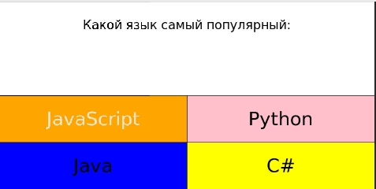  
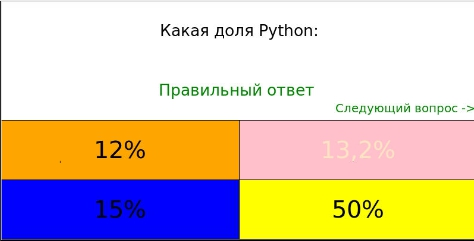  
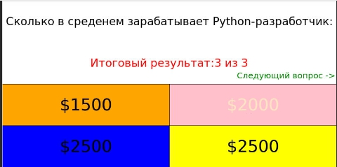  
